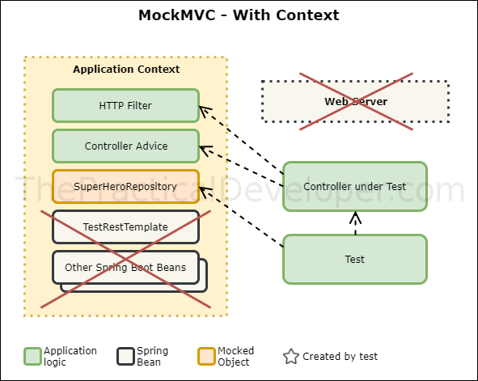

How to test a controller in Spring Boot - a practical guide
===========================================================

There are different ways to test your Controller (Web or API Layer) classes in Spring Boot, some provide support to write _pure_ **Unit Tests** and some others are more useful for **Integration Tests**. Within this post, I’ll cover the main three test approaches available for Spring: using MockMVC in standalone mode, MockMVC together with SpringRunner, and using SpringBootTest.

Introduction
------------

There are a few different approaches to testing available in Spring Boot. It’s a framework that’s constantly evolving, so more options arise in new versions at the same time that old ones are kept for the sake of backward compatibility. The result: multiple ways of testing the same part of our code, and some confusion about when to use what. Within this post, I’ll help you understand the different alternatives, the reasons why they are available and when it’s better to use each one.

This article focuses on Controller testing since it’s the most unclear part, where mocking objects is possible at different levels.

The sample application
----------------------

The logic behind the application is simple: it's a repository of superheroes that you can access through a REST API. It allows to read the available ones (which are hardcoded when the application starts up) and also add new members to the crew.

The architecture is simple: just the Controller layer (REST) and a `SuperHeroRepository`. To illustrate the differences when creating tests, there are two extra classes that work at a web layer level:

* `SuperHeroExceptionHandler`. It's a `ControllerAdvice` that will transform a `NonExistingHeroException` into a `404 NOT_FOUND` HTTP error code.
* `SuperHeroFilter`. This web filter adds a new header to the HTTP response.


We’ll use some sample code through this post to put into practice the different concepts covered.

In summary, it’s just a repository of entities -superheroes- exposed through a REST API. It’s important to list also some particularities of the application to further understand what happens when using the different strategies:

*   If a superhero can't be found by their identifier, a `NonExistingHeroException` is thrown. There is a Spring's `@RestControllerAdvice` that will intercept that exception and transform it into a 404 status code - NOT\_FOUND.
*   There is a `SuperHeroFilter` class that will be used in our HTTP communication to add a header to the HTTP Response: `X-SUPERHERO-APP`.

Server and Client-Side Tests
----------------------------

To start with, we can separate **server-side and client-side tests**.

Server-side tests are the most extended way of testing: you perform your request and you want to check how the server behaves, the response composition, the response content, etc.

The **client-side tests** are not so common, they are useful when you want to verify the request composition and actions. In these tests, you mock the server behavior and then you call some code (on your side) that indirectly will perform a request to that server. That’s _exactly_ what you want to test, you want to verify that _there was a request_ and the contents of that request. You don’t care about the response contents (you mocked that part). Unfortunately, there are not many good examples of this. Even if you check the [official examples,](https://github.com/spring-projects/spring-framework/blob/master/spring-test/src/test/java/org/springframework/test/web/client/samples/SampleTests.java) they are not so helpful (see the Javadoc comments). Anyway, the important idea here is that they can be used when you’re writing a client application and you want to verify the requests from your side to the outside world.

**We’ll focus on server-side Tests,** which are the ones to verify how the server logic works. In this case, you normally mock the requests, and you want to check how your server logic reacts. These kind of tests are tightly related to the Controller layer in your application since it’s the part of Spring that takes care of handling the HTTP requests.

Server-Side Tests
-----------------

If we zoom inside server-side tests, there are two main strategies we can identify in Spring: writing Controller tests using the MockMVC approach, or making use of RestTemplate. You should favor the first strategy (MockMVC) if you want to code a **_real_** Unit Test, whereas you should make use of RestTemplate if you intend to write an Integration Test. The reason is that, with MockMVC, we can fine-grain our assertions for the Controller. RestTemplate, on the other hand, will use the Spring’s WebApplicationContext (partly or fully, depends on using the Standalone mode or not). Let’s explain these two strategies in more detail.

Inside-Server Tests
-------------------

We can test directly our Controller logic without needing a web server. That’s what I call inside-server testing, and it’s closer to the definition of a Unit Test. To make it possible, you need to mock the entire web server behavior, so somehow you’re missing parts to be tested in our application. Don’t worry, because those parts can be perfectly covered with an Integration Test.

### Strategy 1: Spring MockMVC example in Standalone Mode

  [](./images/tests_mockmvc_wm.png)

Test MockMVC Standalone

In Spring, you can write an inside-server test if you use MockMVC in standalone-mode, **so you’re not loading a Spring context**. Let’s see an example of this.

#### MockMVC standalone code example

MockMVC Standalone approach - SuperHeroController
```java
    @ExtendWith(MockitoExtension.class)
    public class SuperHeroControllerMockMvcStandaloneTest {
    
        private MockMvc mvc;
    
        @Mock
        private SuperHeroRepository superHeroRepository;
    
        @InjectMocks
        private SuperHeroController superHeroController;
    
        // This object will be magically initialized by the initFields method below.
        private JacksonTester<SuperHero> jsonSuperHero;
    
        @BeforeEach
        public void setup() {
            // We would need this line if we would not use the MockitoExtension
            // MockitoAnnotations.initMocks(this);
            // Here we can't use @AutoConfigureJsonTesters because there isn't a Spring context
            JacksonTester.initFields(this, new ObjectMapper());
            // MockMvc standalone approach
            mvc = MockMvcBuilders.standaloneSetup(superHeroController)
                    .setControllerAdvice(new SuperHeroExceptionHandler())
                    .addFilters(new SuperHeroFilter())
                    .build();
        }
    
        @Test
        public void canRetrieveByIdWhenExists() throws Exception {
            // given
            given(superHeroRepository.getSuperHero(2))
                    .willReturn(new SuperHero("Rob", "Mannon", "RobotMan"));
    
            // when
            MockHttpServletResponse response = mvc.perform(
                    get("/superheroes/2")
                            .accept(MediaType.APPLICATION_JSON))
                    .andReturn().getResponse();
    
            // then
            assertThat(response.getStatus()).isEqualTo(HttpStatus.OK.value());
            assertThat(response.getContentAsString()).isEqualTo(
                    jsonSuperHero.write(new SuperHero("Rob", "Mannon", "RobotMan")).getJson()
            );
        }
    
        @Test
        public void canRetrieveByIdWhenDoesNotExist() throws Exception {
            // given
            given(superHeroRepository.getSuperHero(2))
                    .willThrow(new NonExistingHeroException());
    
            // when
            MockHttpServletResponse response = mvc.perform(
                    get("/superheroes/2")
                            .accept(MediaType.APPLICATION_JSON))
                    .andReturn().getResponse();
    
            // then
            assertThat(response.getStatus()).isEqualTo(HttpStatus.NOT_FOUND.value());
            assertThat(response.getContentAsString()).isEmpty();
        }
    
        @Test
        public void canRetrieveByNameWhenExists() throws Exception {
            // given
            given(superHeroRepository.getSuperHero("RobotMan"))
                    .willReturn(Optional.of(new SuperHero("Rob", "Mannon", "RobotMan")));
    
            // when
            MockHttpServletResponse response = mvc.perform(
                    get("/superheroes/?name=RobotMan")
                            .accept(MediaType.APPLICATION_JSON))
                    .andReturn().getResponse();
    
            // then
            assertThat(response.getStatus()).isEqualTo(HttpStatus.OK.value());
            assertThat(response.getContentAsString()).isEqualTo(
                    jsonSuperHero.write(new SuperHero("Rob", "Mannon", "RobotMan")).getJson()
            );
        }
    
        @Test
        public void canRetrieveByNameWhenDoesNotExist() throws Exception {
            // given
            given(superHeroRepository.getSuperHero("RobotMan"))
                    .willReturn(Optional.empty());
    
            // when
            MockHttpServletResponse response = mvc.perform(
                    get("/superheroes/?name=RobotMan")
                            .accept(MediaType.APPLICATION_JSON))
                    .andReturn().getResponse();
    
            // then
            assertThat(response.getStatus()).isEqualTo(HttpStatus.OK.value());
            assertThat(response.getContentAsString()).isEqualTo("null");
        }
    
        @Test
        public void canCreateANewSuperHero() throws Exception {
            // when
            MockHttpServletResponse response = mvc.perform(
                    post("/superheroes/").contentType(MediaType.APPLICATION_JSON).content(
                            jsonSuperHero.write(new SuperHero("Rob", "Mannon", "RobotMan")).getJson()
                    )).andReturn().getResponse();
    
            // then
            assertThat(response.getStatus()).isEqualTo(HttpStatus.CREATED.value());
        }
    
        @Test
        public void headerIsPresent() throws Exception {
            // when
            MockHttpServletResponse response = mvc.perform(
                    get("/superheroes/2")
                            .accept(MediaType.APPLICATION_JSON))
                    .andReturn().getResponse();
    
            // then
            assertThat(response.getStatus()).isEqualTo(HttpStatus.OK.value());
            assertThat(response.getHeaders("X-SUPERHERO-APP")).containsOnly("super-header");
        }
    }
```    

The next sections explain this code in detail.

#### MockitoExtension and MockMVC

Prior to JUnit 5, we would use _MockitoJUnitRunner_ to run our unit test. In the new JUnit version, the runner behaviors have been replaced by _Extensions_. This one, the _MockitoExtension_, is provided by Mockito and adds some useful functionalities: detects that we’re using the framework, that there are no unused stubs, and initializes for us all the fields annotated with `@Mock`, so we don’t need to call the `Mockito.initMocks()` method.

Note how we initialize the mocks: our SuperHeroRepository is mocked as usual with the annotation. However, we need it inside our real controller class, so we annotate our SuperHeroController instance with `@InjectMocks`. Then, Mockito injects the mocked repository into the controller instead of the real bean instance.

For each test, we use our MockMVC instance to perform all kind of fake requests (GET, POST, etc.) and we receive a MockHttpServletResponse in return. Keep in mind that’s not a real web server response but simulated by MockMVC.

#### JacksonTester initialization

We use a JacksonTester object, a utility class included in the Spring Boot Test module to generate and parse JSON. We need to initialize it via the `JacksonTester.initFields()` static method below. There is an easier way to configure automatically these Jackson Testers, but we can’t use it in this first approach since it requires a Spring Context. We’ll use it in our next examples. If you want to know more about Jackson Testers, see the [javadoc documentation](http://docs.spring.io/spring-boot/docs/current/api/org/springframework/boot/test/json/JacksonTester.html) for that class.

#### Configure the Standalone Setup in MockMVC

In the setup method, which is executed before every test thanks to the JUnit 5’s _@BeforeEach_ annotation, we need to configure MockMVC in Standalone mode and **explicitly configure our Controller under test, the Controller Advice and our HTTP Filter**. We could also add this initialization to a base test class. In any case, you can see already the main disadvantage of this approach: any part of your logic that is placed outside the Controller class (e.g. ControllerAdvice, Filters) needs to be configured here. The reason is that you don’t have any Spring context that can inject them automatically.

#### Testing ControllerAdvice and Filter with MockMVC

Pay attention to how we can verify our surrounding logic: in line 60 we check that a request with an non existing id ends up with a response with a NOT\_FOUND code, so the Controller Advice is working fine. We also have a test method to verify that the header is present, so our Filter is also doing its work. You can do a quick exercise with this code: remove the part of the standalone setup in which we specified the advice and the filter, and run the test again. As expected, it would fail in that case since there is no context to inject these classes.

For the sake of the educational purpose of this post, I included in this test the Filter and the ControllerAdvice. We could decide not to do that, and leave the tests that verify the presence of the header and the 404 status code to an **integration test** (so we remove them from here and from the standalone configuration). If we do that we have **a pure version of Unit Test: we are testing only the Controller class logic, without any other interference**.

#### Better Assertions with BDDMockito and AssertJ

As a side remark: the code uses BDDMockito and AssertJ to write human-readable, fluent-style tests. If you want to know more about this technique, save this other post for a later read: [Write BDD Unit Tests with BDDMockito and AssertJ](https://thepracticaldeveloper.com/write-bdd-unit-tests-with-bddmockito-and-assertj/).

### Strategy 2: Spring MockMVC example with WebApplicationContext

  [](./images/tests_mockmvc_with_context_wm.png)

Test MockMVC with Context

The second strategy we can use to write Unit Tests for a Controller also involves MockMVC, but in this case we use a Spring’s _WebApplicationContext_. Since we’re still using an inside-server strategy, there is **no web server deployed** in this case though.

#### MockMVC and WebMvcTest code example

```java
    @AutoConfigureJsonTesters
    @WebMvcTest(SuperHeroController.class)
    public class SuperHeroControllerMockMvcWithContextTest {
    
        @Autowired
        private MockMvc mvc;
    
        @MockBean
        private SuperHeroRepository superHeroRepository;
    
        // This object will be initialized thanks to @AutoConfigureJsonTesters
        @Autowired
        private JacksonTester<SuperHero> jsonSuperHero;
    
        @Test
        public void canRetrieveByIdWhenExists() throws Exception {
            // given
            given(superHeroRepository.getSuperHero(2))
                    .willReturn(new SuperHero("Rob", "Mannon", "RobotMan"));
    
            // when
            MockHttpServletResponse response = mvc.perform(
                    get("/superheroes/2")
                            .accept(MediaType.APPLICATION_JSON))
                    .andReturn().getResponse();
    
            // then
            assertThat(response.getStatus()).isEqualTo(HttpStatus.OK.value());
            assertThat(response.getContentAsString()).isEqualTo(
                    jsonSuperHero.write(new SuperHero("Rob", "Mannon", "RobotMan")).getJson()
            );
        }
    
        // ...
        // Rest of the class omitted, it's the same implementation as in Standalone mode
    
    }
```    

When compared with the Standalone mode, these are the main differences:

#### SpringExtension

This time, we need to use a JUnit 5 extension named _SpringExtension_, which is provided by Spring. This extension causes the initialization of part of the Spring context. When you run the test, you can see at the beginning of the trace how the context starts loading and the injected beans. **Note that we don’t need to include this extension explicitly since it’s already included in all the Spring’s `@...Test` shortcut annotations.** See the [source code of the WebMvcTest class](https://github.com/spring-projects/spring-boot/blob/2.4.x/spring-boot-project/spring-boot-test-autoconfigure/src/main/java/org/springframework/boot/test/autoconfigure/web/servlet/WebMvcTest.java#L82) for an example of how this annotation is included there.

#### MockMVC Autoconfiguration

With the _@WebMVCTest_ annotation our MockMVC instance gets auto-configured and available in the context (so we can autowire it as you see below in the code). Besides, we specify in the annotation the controller class we want to test. Thanks to this annotation, Spring will load only a partial context (the controller and its surrounding configuration like filters and advices).

Since Spring is smart enough to know that our Filter and the Controller Advice should also be injected, there is no need for explicit configuration in the `setup()` method.

#### Overriding beans for testing using MockBean

In this case, we inject a fake repository in the Spring’s context using the @MockBean annotation. This fake repository bean will replace the real repository implementation.

We also don’t need to make any reference to our controller class apart from the one in the WebMVCTest annotation, since the controller will be injected in the context automatically.

#### No server calls

Bear in mind that the responses we’re verifying are still _fake_. There is no web server involved in this test either. In any case, it’s a perfectly valid test since we’re checking our logic inside our class and, at the same time, some related logic inside _SuperHeroExceptionHandler_ and _SuperHeroFilter_.

#### Using MockMVC with a Web Application Context - Conclusions

The most important difference of this approach is that we didn’t need to explicitly load the surrounding logic since there is a partial Spring context in place. If we create new filters, new controller advices, or any other logic participating in the request-response process, we will get them automatically injected in our test. Therefore, we don’t need to take care of the manual configuration here. There is no fine-grain control over what to use in our test, but it’s closer to what happens in reality. When we run our application, all this stuff is there by default.

You can see here a small transition to Integration Testing. In this case, we’re testing the filter and the controller advice out of the box, without making any reference to them. If we would include in the future any other class intervening the request-response flow, it would participate in this test as well.

Since this test includes more than a single class behavior, you could indeed classify it as an **Integration Test** between those classes. The line is blurry though: you could argue that there is only one Controller under test, but you need the extra configuration to properly test it.

Outside-Server Tests
--------------------

When you perform an HTTP request to your application to test it, you’re running what I call an **outside-server test**. However, even _being outside_ you can inject mocks also in these tests, so you could get something similar to a Unit Test also in this case. For instance, [in a classical 3-layered application](https://thepracticaldeveloper.com/learn-microservices-v2/), you could mock the Service layer and test only your Controller through a web server. In practice, **this approach is much heavier compared to a pure Unit Test**. You’re loading the entire application context unless you tell Spring not to do so by excluding configuration or only including what you need.

In Spring, you can write outside-server tests for REST controllers using a standard _RestTemplate_ to perform your requests, or the test-specific _TestRestTemplate_, which includes some useful features for integration testing (like the ability to include authentication headers).

In Spring Boot, you normally use the _@SpringBootTest_ annotation when you want to create tests that use the context. Then, you get your beans injected in the context, access to the application properties, etc. It’s a convenient alternative to the classic _@ContextConfiguration_ annotation in Spring that includes all the Spring Boot features for your test.

Testing Strategies in Spring Boot may be confusing given the number of features and available options. Let’s have a look at those strategies, same as we did for MockMVC.

### Strategy 3: SpringBootTest example with a MOCK WebEnvironment value

If you use @SpringBootTest without parameters, or with `webEnvironment = WebEnvironment.MOCK`, **you don’t load a real HTTP server**. Does it sound familiar? **It’s a similar approach to the strategy 2 (MockMVC with an application context)**. When we use this configuration, we’re still coding an _inside-server test_.

In this setup, we can’t use a standard RestTemplate since we don’t have any web server. We need to keep using MockMVC, which now is getting configured thanks to the extra annotation _@AutoconfigureMockMVC_. This is the trickiest approach between all the available ones in my opinion, and I personally discourage using it. Instead, it’s better to choose the Strategy 2 with MockMVC and the context loaded for a specific controller. You’ll be more in control of what you’re testing.

See below the source code changes when we use this strategy.

```java
    @AutoConfigureJsonTesters
    @SpringBootTest
    @AutoConfigureMockMvc
    public class SuperHeroControllerSpringBootMockTest {
    
        @Autowired
        private MockMvc mvc;
    
        @MockBean
        private SuperHeroRepository superHeroRepository;
    
        // This object will be initialized thanks to @AutoConfigureJsonTesters
        @Autowired
        private JacksonTester<SuperHero> jsonSuperHero;
    
        @Test
        public void canRetrieveByIdWhenExists() throws Exception {
            // given
            given(superHeroRepository.getSuperHero(2))
                    .willReturn(new SuperHero("Rob", "Mannon", "RobotMan"));
    
            // when
            MockHttpServletResponse response = mvc.perform(
                    get("/superheroes/2")
                            .accept(MediaType.APPLICATION_JSON))
                    .andReturn().getResponse();
    
            // then
            assertThat(response.getStatus()).isEqualTo(HttpStatus.OK.value());
            assertThat(response.getContentAsString()).isEqualTo(
                    jsonSuperHero.write(new SuperHero("Rob", "Mannon", "RobotMan")).getJson()
            );
        }
    
        // ...
        // Rest of the class omitted, it's the same implementation as before
    
    }
```    

### Strategy 4: SpringBootTest example with a Real Web Server

  [](./images/tests_springboot_wm-1.png)

@SpringBoot test approach

When you use @SpringBootTest with `WebEnvironment.RANDOM_PORT` or `WebEnvironment.DEFINED_PORT)`, you’re testing with a real HTTP server. In this case, you need to use a _RestTemplate_ or _TestRestTemplate_ to perform the requests.

The difference between using a random port or a defined port is just that in the first case the default port 8080 (or the one you override with the `server.port` property) won’t be used but replaced with a randomly-assigned port number. This is helpful when you want to run parallel tests, to avoid port clashing. Let’s have a look at the code and then describe the main characteristics.

#### Spring Boot Test Code Example

```java
    @SpringBootTest(webEnvironment = WebEnvironment.RANDOM_PORT)
    public class SuperHeroControllerSpringBootTest {
    
        @MockBean
        private SuperHeroRepository superHeroRepository;
    
        @Autowired
        private TestRestTemplate restTemplate;
    
        @Test
        public void canRetrieveByIdWhenExists() {
            // given
            given(superHeroRepository.getSuperHero(2))
                    .willReturn(new SuperHero("Rob", "Mannon", "RobotMan"));
    
            // when
            ResponseEntity<SuperHero> superHeroResponse = restTemplate.getForEntity("/superheroes/2", SuperHero.class);
    
            // then
            assertThat(superHeroResponse.getStatusCode()).isEqualTo(HttpStatus.OK);
            assertThat(superHeroResponse.getBody().equals(new SuperHero("Rob", "Mannon", "RobotMan")));
        }
    
        @Test
        public void canRetrieveByIdWhenDoesNotExist() {
            // given
            given(superHeroRepository.getSuperHero(2))
                    .willThrow(new NonExistingHeroException());
    
            // when
            ResponseEntity<SuperHero> superHeroResponse = restTemplate.getForEntity("/superheroes/2", SuperHero.class);
    
            // then
            assertThat(superHeroResponse.getStatusCode()).isEqualTo(HttpStatus.NOT_FOUND);
            assertThat(superHeroResponse.getBody()).isNull();
        }
    
        @Test
        public void canRetrieveByNameWhenExists() {
            // given
            given(superHeroRepository.getSuperHero("RobotMan"))
                    .willReturn(Optional.of(new SuperHero("Rob", "Mannon", "RobotMan")));
    
            // when
            ResponseEntity<SuperHero> superHeroResponse = restTemplate
                    .getForEntity("/superheroes/?name=RobotMan", SuperHero.class);
    
            // then
            assertThat(superHeroResponse.getStatusCode()).isEqualTo(HttpStatus.OK);
            assertThat(superHeroResponse.getBody().equals(new SuperHero("Rob", "Mannon", "RobotMan")));
        }
    
        @Test
        public void canRetrieveByNameWhenDoesNotExist() {
            // given
            given(superHeroRepository.getSuperHero("RobotMan"))
                    .willReturn(Optional.empty());
    
            // when
            ResponseEntity<SuperHero> superHeroResponse = restTemplate
                    .getForEntity("/superheroes/?name=RobotMan", SuperHero.class);
    
            // then
            assertThat(superHeroResponse.getStatusCode()).isEqualTo(HttpStatus.OK);
            assertThat(superHeroResponse.getBody()).isNull();
        }
    
        @Test
        public void canCreateANewSuperHero() {
            // when
            ResponseEntity<SuperHero> superHeroResponse = restTemplate.postForEntity("/superheroes/",
                    new SuperHero("Rob", "Mannon", "RobotMan"), SuperHero.class);
    
            // then
            assertThat(superHeroResponse.getStatusCode()).isEqualTo(HttpStatus.CREATED);
        }
    
        @Test
        public void headerIsPresent() throws Exception {
            // when
            ResponseEntity<SuperHero> superHeroResponse = restTemplate.getForEntity("/superheroes/2", SuperHero.class);
    
            // then
            assertThat(superHeroResponse.getStatusCode()).isEqualTo(HttpStatus.OK);
            assertThat(superHeroResponse.getHeaders().get("X-SUPERHERO-APP")).containsOnly("super-header");
        }
    
    }
```    

We can focus now on the differences.

#### Web Server Testing

Now, we annotate our test with _@SpringBootTest_, and a _RANDOM\_PORT_ web-environment mode. Just by doing that, we’ll get a web server up and running for our tests.

In this case, we trigger the requests using a REST template (line 18), more specifically its `TestRestTemplate` extension, same as if we were trying to reach an external server.

The assertions change now a bit since the response we want to verify is now a _ResponseEntity_ instead of a _MockHttpServletResponse_. As you can see, they’re very similar.

#### Mocking layers

Note that we still have the ability to mock the repository layer with the @MockBean annotation.

#### TestRestTemplate

We have a _TestRestTemplate_ bean available in the context because we’re using the @SpringBootTest annotation. This test version behaves exactly the same as a standard RestTemplate, but has some extra functionalities as seen before.

#### SpringBootTest approach - Conclusions

Even though our goal is the same - testing the Controller layer, **this test approaches the solution from a totally different angle** compared to the one in Strategy 1 (MockMVC in standalone mode). Earlier, we were just loading our class and not even the surrounding actors (filter and controller advice). Here, we’re loading the entire Spring Boot context with the web server included. This approach is the heaviest of all, and **the furthest away from the concept of a Unit Test**.

This strategy is mainly intended for **Integration Tests**. The idea is that you can still mock beans and replace them in the context, but you can verify interactions between different classes in your Spring Boot application, with the web server participating as well.

I would avoid using this strategy for Unit Tests. You’re building _fat tests_ and you may also lose control of what you’re testing. You should favor this approach for Integration Tests though. These tests are very useful in your application to verify how the different components work together.

### Performance and Context Caching

You may think that Strategy 1 is much more optimal in performance than others. Or Strategy 4 may perform terribly if you need to load the entire Spring Boot Context every time you run a test. Well, that’s not entirely correct. When you use Spring (including Boot) for testing, the application context _will be reused by default during the same Test Suite_.

That means, in our case, that Strategies 2, 3 and 4 reuse the Spring context after it’s loaded for the first time. However, keep in mind that reusing the context might cause some side effects if your tests modify Spring beans. If that’s your case, you’ll need to do some tricks with the _@DirtiesContext_, indicating that you want to reload the context before each test (see [the docs](https://docs.spring.io/spring/docs/current/spring-framework-reference/html/integration-testing.html#__dirtiescontext) if you’re curious).

Conclusion
----------

As we saw, we have many alternatives to build Unit Tests for our Controllers in Spring Boot. We covered from the lightest to the heaviest one. It’s time to give you some recommendations about when to use what:

*   Try always to write Unit Tests for your Controller logic without focusing on any other behavior. Go for Strategy 1: **use MockMVC in Standalone mode**.
*   If you need to test some surrounding behavior related to the Web Layer (such as filtering, interceptors, authentication, etc.), then choose **Strategy 4: SpringBootTest with a web server** on a **random port**. However, treat it as an Integration Test since you’re verifying several parts of your application. Don’t skip the Unit Test for the pure Controller layer if you need it. In other words, try to avoid mixing the test layers but rather keep them separate.

Now that you are looking into testing controllers maybe you’re also interested in [Customizing Error Handling in your REST Controllers](https://thepracticaldeveloper.com/custom-error-handling-rest-controllers-spring-boot/), check the [new guide](https://thepracticaldeveloper.com/custom-error-handling-rest-controllers-spring-boot/) for more details.
